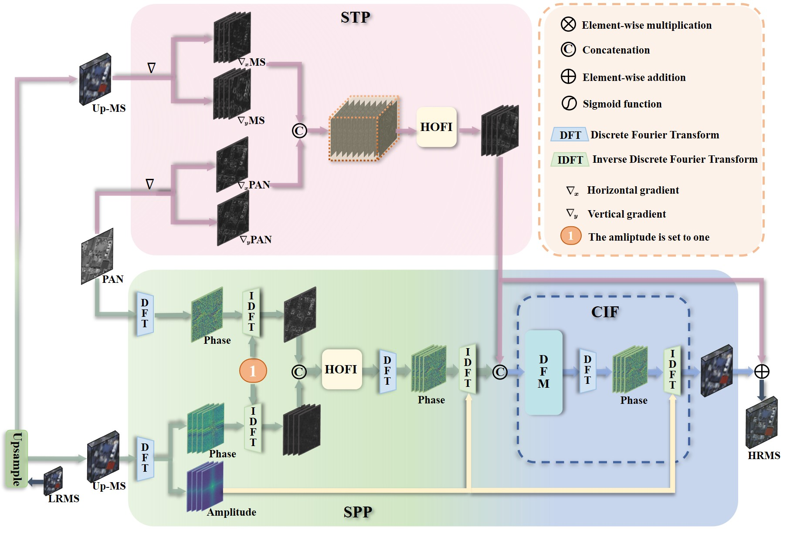

# <p align=center> :fire: `Domain-irrelevant Feature Learning for Generalizable Pan-sharpening (ACMMMM 2023)`</p>

  [

This is the official PyTorch codes for the paper.  
>**Domain-irrelevant Feature Learning for Generalizable Pan-sharpening**<br>  [Yunlong Lin<sup>*</sup>](https://scholar.google.com.hk/citations?user=5F3tICwAAAAJ&hl=zh-CN), [Zhenqi fu<sup>*</sup>](https://zhenqifu.github.io/index.html), [Ge Meng](), [Yingying Wang](), [Yuhang Dong](), [Linyu Fan](),  [Hedeng Yu](), [Xinghao Ding†](https://scholar.google.com.hk/citations?user=k5hVBfMAAAAJ&hl=zh-CN&oi=ao)（ * co-first author. † indicates corresponding author)<br>

<div align=center></div>

## Abstract
> Pan-sharpening aims to spatially enhance the low-resolution multispectral image (LRMS) by transferring high-frequency details from a panchromatic image (PAN) while preserving the spectral
characteristics of LRMS. Previous arts mainly focus on how to learn a high-resolution multispectral image (HRMS) on the i.i.d. assumption. However, the distribution of training and testing data
often encounters significant shifts in different satellites. To this end, this paper proposes a generalizable pan-sharpening network via domain-irrelevant feature learning. On the one hand, a structural
preservation module (STP) is designed to fuse high-frequency information of PAN and LRMS. Our STP is performed on the gradient domain because it consists of structure and texture details that can
generalize well on different satellites. On the other hand, to avoid spectral distortion while promoting the generalization ability, a spectral preservation module (SPP) is developed. The key design
of SPP is to learn a phase fusion network of PAN and LRMS. The amplitude of LRMS, which contains ‘satellite style’ information is directly injected in different fusion stages. Extensive experiments have demonstrated the effectiveness of our method against state-ofthe-art methods in both single-satellite and cross-satellite scenarios.
### :rocket: Highlights:
- **SOTA performance**: The proposed DIRFL achieves better generalization performance than existing SOTA pan-sharpening methods over multiple satellite datasets.

## Dependencies and Installation
- Ubuntu >= 18.04
- CUDA >= 11.0
- NumPy
- Matplotlib
- OpenCV
- PyYAML
```
# git clone this repository
git clone https://github.com/LYL1015/DIRFL.git
cd DIRFL

# create new anaconda env
conda create -n DIRFL python=3.8
conda activate DIRFL

pip install torch numpy matplotlib opencv-python pyyaml
```
## Datasets
Training dataset, testing dataset are available at [Data](https://github.com/manman1995/Awaresome-pansharpening).

The directory structure will be arranged as:
```
Data
    |- WV3_data
        |- train128
            |- pan
                |- xxx.tif
            |- ms
                |- xxx.tif
        |- test128
            |- pan
            |- ms
    |-  WV2_data
        |- train128
            |- pan
            |- ms
        |- test128
            |- pan
            |- ms
    |-  GF2_data
        |- ...
```

## Testing the Model

To test the trained pan-sharpening model, you can run the following command:

```
python test.py
```

## Configuration

The configuration options are stored in the `option.yaml` file and `test.py`. Here is an explanation of each of the options:

#### algorithm

- algorithm: The model for testing

#### Testing

- `algorithm`: The algorithm to use for testing.
- `type`: The type of testing, `test`
- `data_dir`: The location of the test data.
- `source_ms`: The source of the multi-spectral data.
- `source_pan`: The source of the panchromatic data.
- `model`:  The model path to use for testing.
- `save_dir`: The location to save the test results.
- `test_config_path` : The configuration file path for models
  
#### Data Processing

- `upscale`: The upscale factor.
- `batch_size`: The size of each batch.
- `patch_size`: The size of each patch.
- `data_augmentation`: Whether to use data augmentation.
- `n_colors`: The number of color channels.
- `rgb_range`: The range of the RGB values.
- `normalize`: Whether to normalize the data.

## Acknowledgements

Our work is based on the following projects:
- [Awaresome-pansharpening](https://github.com/manman1995/Awaresome-pansharpening/tree/main)


## Citation

If you find DIRFL is useful in your research, please cite our paper:

```
@inproceedings{lin2023domain,
  title={Domain-irrelevant Feature Learning for Generalizable Pan-sharpening},
  author={Lin, Yunlong and Fu, Zhenqi and Meng, Ge and Wang, Yingying and Dong, Yuhang and Fan, Linyu and Yu, Hedeng and Ding, Xinghao},
  booktitle={Proceedings of the 31st ACM International Conference on Multimedia},
  pages={3287--3296},
  year={2023}
}
```

